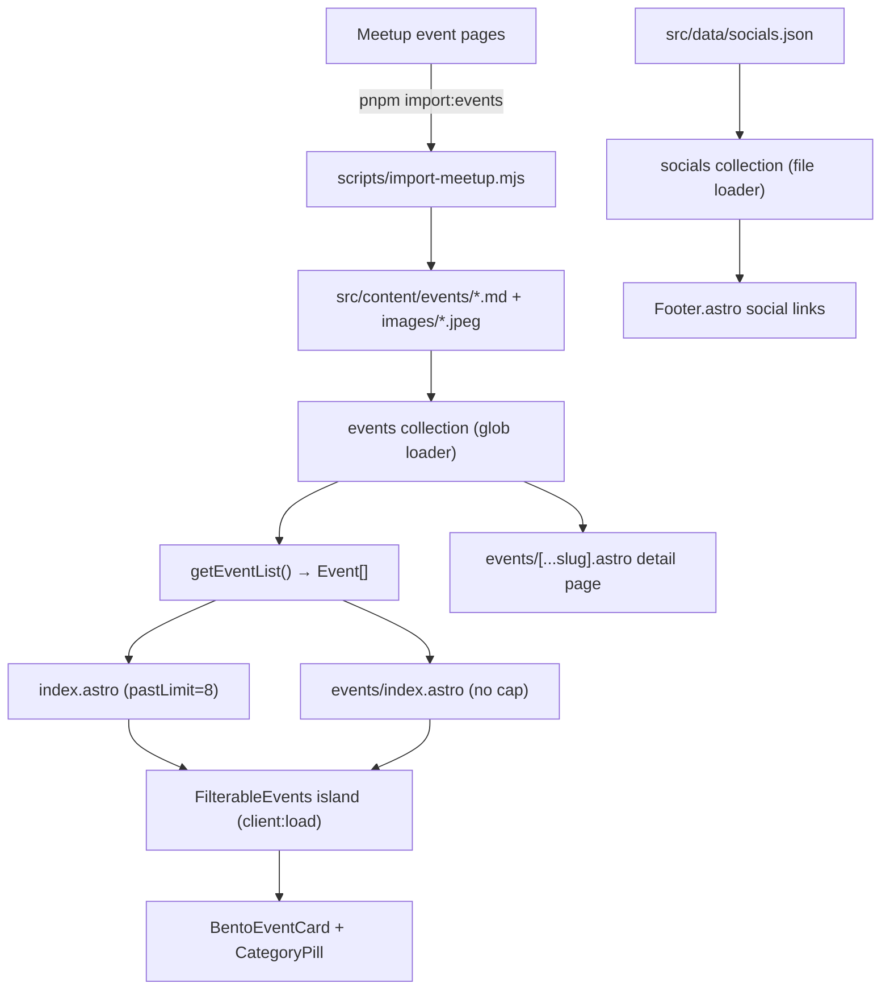
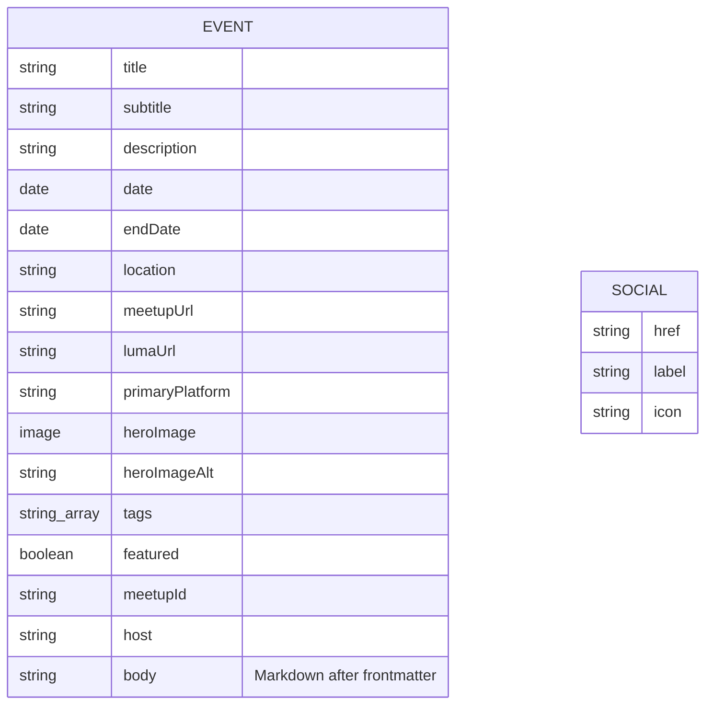
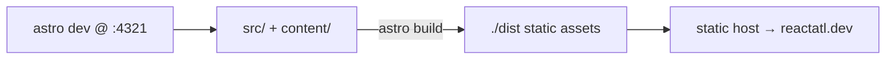

# System Design — ReactATL Website

> Evergreen root document and bundle entry point. Highest-level view of the system
> and the fastest on-ramp for a new contributor (human or agent). Dated specs/ADRs
> are **sources** — harvested and cited here, not rewritten; the bundle map is
> §15 / `docs/index.md`. When any source disagrees with the code/runtime, the
> code is the source of truth.

## 1. Project Overview

- **Project** — `reactatl-site` (package.json), the community website for ReactATL, Atlanta's React developer meetup. Live at [reactatl.dev](https://reactatl.dev) (`astro.config.mjs:9`).
- **Description** — A statically-generated marketing + events site. Its core job is to present the group's meetup events (upcoming and past), let visitors filter them by category, and give each event an SEO-rich detail page that links out to RSVP on Meetup and/or Luma. Event content is **owned in-repo** as Markdown, not fetched at build time.
- **Stakeholders** — ReactATL organizers (maintainers/authors), the Atlanta React community (readers/attendees). *(Roles inferred from repo purpose.)*
- **Assumptions** — Single static output, no server runtime, no user accounts, no database. All dates are rendered in US Eastern time (`src/lib/dates.ts`). Event ingestion is a manual/scripted step run by a maintainer, not part of `astro build`.
- **Core use-cases** — (must) list & filter events, per-event detail pages with structured data and RSVP links, import/refresh events from Meetup. (non-goals) no CMS, no auth, no comments, no client-side data fetching.

## 2. Requirements

### Functional (verified against code)
- **Homepage** (`src/pages/index.astro`) — renders `Hero`, a `FilterableEvents` island capped at 8 past events (`pastLimit={8}`), `About`, `Stats`.
- **Events archive** (`src/pages/events/index.astro`) — full `FilterableEvents` island, no cap.
- **Event detail** (`src/pages/events/[...slug].astro`) — one static page per event (`getStaticPaths` over the `events` collection), hero image, rendered Markdown body, meta, up to two RSVP buttons, and schema.org `Event` JSON-LD.
- **Category filtering** — client-side, in `FilterableEvents` via `matchesCategory` (`src/types/events.ts`).
- **Event import** — `scripts/import-meetup.mjs` (invoked by `pnpm import:events`) fetches Meetup content and writes/refreshes event `.md` files + hero images.

### Non-Functional (real posture)
- **Rendering** — fully static (`astro build` → `./dist/`); no SSR adapter configured.
- **Performance** — hero images optimized at build via Astro `image()` + `sharp`; fonts preconnected/loaded from Google Fonts (`src/layouts/Layout.astro`).
- **Security** — no auth, no secrets, no user input handled at runtime (see §7).
- **Maintainability** — TypeScript throughout; content validated by Zod schema (`src/content.config.ts`). No linter, no test suite, no CI configured (honest limit).

## 3. System Architecture

### Technology stack (exact, from `package.json` + installed)
- **Astro 7.1.3** (installed; note: prior docs said "Astro 5" — see §14) — static site generator, islands architecture.
- **React 19.2.8** + **@astrojs/react 6.0.1** — interactive islands.
- **Tailwind CSS 4.3.3** via `@tailwindcss/vite` (`astro.config.mjs`).
- **class-variance-authority 0.7.1**, **clsx 2.1.1**, **tailwind-merge 3.6.0** — shadcn/ui styling patterns.
- **astro-icon 1.1.5** + `@iconify-json/lucide`, `@iconify-json/simple-icons`; **lucide-react 0.563.0** for React-side icons.
- **sharp 0.35.3** — build-time image optimization.
- **TypeScript 6.0.3**, **@astrojs/check 0.9.9** — `astro check` type validation.
- Frontend framework only; **no backend, no datastore, no server runtime.**

### System components
- **Content layer** — Astro content collections (`events`, `socials`) defined in `src/content.config.ts`.
- **Data-mapping layer** — `src/lib/events.ts` (`getEventList`), `src/lib/dates.ts` (`formatEventDate`), `src/types/events.ts` (types + category logic).
- **Presentation layer** — Astro components (`Header`, `Hero`, `About`, `Stats`, `Footer`, `Layout`) + React islands (`FilterableEvents`, `BentoEventCard`, `CategoryPill`, `button`).
- **Ingestion layer** — `scripts/import-meetup.mjs` (external, build-excluded).
- **External services consumed** — Meetup (import-time HTML scrape), Google Fonts (runtime CSS), Meetup/Luma (outbound RSVP links only).
- **Design system** — the site's visual language (colors, typography, layout, elevation, shapes, components, do's & don'ts) is documented in `docs/DESIGN.md`; the tokens there mirror `src/styles/global.css` and the font loads in `src/layouts/Layout.astro`. Consult it before adding or restyling UI.

## 4. Module Design

### `src/lib/events.ts` — `getEventList()`
- **Purpose** — the single serializable-`Event[]` source consumed by all pages/islands.
- **Inputs** — `getCollection("events")`.
- **Outputs** — `Event[]` (`src/types/events.ts`), sorted newest-first by `date`.
- **Flow** — sort desc by `data.date`; for each entry derive `dateLabel`/`timeLabel` via `formatEventDate`, set `upcoming = date.getTime() >= Date.now()`, map to the flat `Event` shape (`slug = e.id`). `upcoming` and the date/time **labels are derived here, never stored** in frontmatter.

### `src/lib/dates.ts` — `formatEventDate(date)`
- Formats to `America/New_York` via `Intl.DateTimeFormat`: `dateLabel` = "Month D, YYYY", `timeLabel` = "h:mm TZ". Fixed ET timezone regardless of build host.

### `src/types/events.ts` — types + category resolution
- `Event` interface (flat, serializable): `slug, title, subtitle?, description?, dateISO, date, time, location?, upcoming, tags?, featured?`.
- `CATEGORIES` (the filter pills): `All Events, React, Community, Leadership, AI, Career`.
- **`CATEGORY_TAG_MAP`** (ground truth — supersedes any prose in README/prior AGENTS.md):
  - `All Events` → `[]` (matches everything)
  - `React` → `React, React Native, Remix, Platform Engineering`
  - `Community` → `Community, Social, Conference`
  - `Leadership` → `Leadership`
  - `AI` → `AI, Tools`
  - `Career` → `Career, Panel, Workshop`
- **`matchesCategory(event, category)`** — resolution algorithm: `All Events` always matches; otherwise true iff any of the event's `tags` **case-insensitively contains** (substring `includes`) any tag in the category's list. Substring match means e.g. tag `"React Native"` matches category `React`.

### `src/components/FilterableEvents.tsx` (island, `client:load`)
- State: `activeCategory` (`useState`, default `All Events`).
- Derives (memoized): `filteredEvents` (by category), `upcomingEvents` (`upcoming`, sorted ascending by date), `pastEvents` (`!upcoming`, sorted descending). `visiblePast = pastLimit ? pastEvents.slice(0, pastLimit) : pastEvents`.
- Renders `CategoryPill` row, an Upcoming section, and a Past section. All cards are `BentoEventCard`.

### `src/components/ui/BentoEventCard.tsx`
- Props: `title, date, time?, location?, tags?, link?, accent?, variant?("light"|"dark"), size?("small"|"medium"|"large")`.
- `ACCENTS` = 4 two-blob gradient pairs (cyan/blue, orange/amber, pink/rose, emerald/green); selected by `accent % ACCENTS.length` so adjacent tiles differ. Tiles carry **no per-event photo** — hero images appear only on detail pages. Renders as an `<a href={link}>` (internal link to `/events/<slug>`).

### `src/components/ui/CategoryPill.tsx`
- Filter button with `isActive` (cyan bg) / inactive (transparent + border) states.

### `src/pages/events/[...slug].astro`
- `getStaticPaths` maps every event to `{ params: { slug: event.id } }`.
- Builds a 1200×630 cover-cropped JPEG OG image from `heroImage` via `getImage()` (JPEG chosen for crawler compatibility — see comment at `[...slug].astro:16`).
- RSVP link ordering: `primary = data.primaryPlatform ?? (lumaUrl ? "luma" : "meetup")`; both platform links filtered to those present, sorted so `primary` is first (filled button). Verb is "RSVP on" if upcoming else "View on".
- Emits schema.org `Event` JSON-LD (online vs offline attendance mode from `location`).

### `scripts/import-meetup.mjs` (ingestion, build-excluded)
- See §6 for the consumed-interface details.

## 5. Data Model

**No database.** The "data model" is Astro content collections (`src/content.config.ts`), backed by files.

- **`events` collection** — `glob({ pattern: "*.md", base: "./src/content/events" })`. One `.md` file per event: typed frontmatter + rich Markdown body (the full description). 25 event files + 25 co-located `images/<slug>.jpeg` at time of writing.
- **`socials` collection** — `file("./src/data/socials.json")`, schema `{ href, label, icon }`. 4 entries: Meetup, Discord, Bluesky, YouTube.
- **Zod constraints** — `date`/`endDate` coerced to `Date`; `meetupUrl`/`lumaUrl` are `.url()`; `.refine()` requires **at least one** of `meetupUrl`/`lumaUrl`; `tags` defaults `[]`, `featured` defaults `false`; `heroImage` via `image()` (build-optimized).
- **Indexes / transactions** — N/A (file-backed collections).
- **Note** — `socials.json` `id` field is present in the data but **not** in the Zod schema (unschematized extra key, tolerated).

## 6. API / Interface Design

**Exposes no API of its own** (static site). Two "interfaces" exist:

### Consumed: Meetup (import-time only)
- `scripts/import-meetup.mjs` fetches each Meetup event page HTML with a browser `user-agent`, extracts the `<script id="__NEXT_DATA__">` JSON, then reads Meetup's Apollo GraphQL cache at `props.pageProps.__APOLLO_STATE__` (fallback: `deepFindApollo` walks for an `Event:` key). It pulls the event by `Event:<id>`, then resolves photo (`highResUrl`), venue, and host from Apollo `__ref` pointers.
- **Curation preservation** — re-runs parse existing frontmatter and preserve `tags`, `featured`, `subtitle`, `primaryPlatform`; slugs are stable via `meetupId`.
- **Cross-platform pairing** — `LINK_PAIRS` (keyed by Luma slug) and per-entry `--luma=` associate a Meetup event with its Luma counterpart.
- **Seed behavior** — with positional URL args it imports those; with none it refreshes all, preferring a `src/data/events.json` seed file if present, else rebuilding the entry list from the committed `.md` files. The seed file is absent in-repo (migration already done) — refresh now reads committed `.md`.
- Usage: `pnpm import:events` (refresh all) or `node scripts/import-meetup.mjs <meetupUrl> [--luma=<lumaUrl>]` (add one).

### File "interface": event Markdown
- Detection = any `*.md` under `src/content/events/`. Frontmatter shape is the Zod schema in §5; body is the rendered description.

## 7. Security Design
- **Auth** — N/A. No accounts, no login, no protected routes; single public static site.
- **Credentials** — none. The importer makes unauthenticated public GET requests to Meetup; no API keys or secrets anywhere.
- **In transit / at rest** — TLS is the host's concern (static assets); no data at rest beyond committed files.
- **Secrets policy** — no `.env` usage in source; `.gitignore` present. No secrets committed (verified: no credential mechanisms in code).
- **User input** — none processed at runtime (no forms, no server). Outbound RSVP links use `target="_blank" rel="noopener noreferrer"`.
- **PII** — event `host` names come from public Meetup data; no attendee/person-level records stored.

## 8. Deployment Architecture

- **Environments** — local dev (`pnpm dev`, `localhost:4321`); production is a static bundle served at `reactatl.dev`. No staging defined in-repo; no deploy config committed (host/CI is external — see §14).
- **Install / run** — `pnpm install`; `pnpm dev` / `pnpm build` / `pnpm preview`.
- **Scaling** — static files behind a CDN; scaling is the host's concern. No server to scale.
- **Monitoring** — N/A in-repo.

## 9. Testing Strategy
- **No automated tests.** No test runner, no `test` script in `package.json`, no `*.test.*`/`*.spec.*` files, no `.github/workflows` CI (all verified).
- The available quality gate is `astro check` (via `@astrojs/check`) for type validation and `astro build` as a full smoke build.

## 10. Maintenance and Monitoring
- **Logging / alerting / error tracking** — N/A (static site, no runtime). The importer logs to stderr on failure (`main().catch`).
- Health = "does `astro build` succeed"; there is no runtime health surface.

## 11. Backup and Recovery
- **Source of truth** — the git repository. Event content (`.md` + images), `socials.json`, and all source are committed.
- **Recovery** — rebuild from git + `pnpm install` + `pnpm build`. Event content can also be re-derived from Meetup via `pnpm import:events`, but committed `.md` files are authoritative (imports preserve curation).
- **Hazard** — the importer overwrites event `.md`/images on refresh; curated frontmatter is preserved by design, but body edits made by hand would be replaced on the next import.

## 12. Risks and Mitigation

| Risk | Evidence | Mitigation | Label |
|---|---|---|---|
| Meetup HTML/Apollo structure changes break the importer | `fetchApolloEvent` depends on `__NEXT_DATA__` + `__APOLLO_STATE__` shape (`import-meetup.mjs:77-92`) | Committed `.md` files are authoritative; import is not on the build path | DOCUMENTED |
| Hand edits to an event body lost on re-import | `processEntry` rewrites `.md` (§11) | Prefer editing via curated frontmatter; treat body as import-owned | DOCUMENTED |
| No tests/CI → silent regressions | §9 | Run `astro check` + `astro build` before publishing | DOCUMENTED |
| Category filter misses a tag | `matchesCategory` only matches tags in `CATEGORY_TAG_MAP` (§4) | Keep the map in sync when introducing new tags | INFERRED |

## 13. Future Enhancements
- No `TODO`/`FIXME` markers or roadmap sources found in the repo. Roadmap is unrecorded here (no plans/ dir).
- Natural growth areas (inferred): automated `astro check`/build in CI; a test for `matchesCategory`; sitemap/RSS.

---

## 14. Validation Findings & Known Drift

- **Spec ↔ code drift (found, now fixed this pass):**
  - **Astro version** — `README.md:9` and the prior AGENTS.md said "Astro 5"; installed and pinned is **Astro 7.1.3** (`package.json`, `node_modules/astro`). Both corrected: README now reads "Astro 7"; the leaned AGENTS.md Architecture Summary states 7.x.
  - **Category tag map** — `README.md` and the prior AGENTS.md both listed categories that did not match `src/types/events.ts` (claimed `Wellness`, `Mobile`, `Open Source`, `Security`; mis-placed `Platform Engineering`/`Conference` under Leadership). Both corrected to code truth (§4): `Platform Engineering` under **React**, `Conference` under **Community**, `Tools` under **AI**, `Panel`/`Workshop` under **Career**, `Leadership` matches only `Leadership`.
  - **YouTube link** — `README.md` linked `youtube.com/channel/UCld-...`; `src/data/socials.json` uses `youtube.com/@ReactATL`. README corrected to match socials.json (ground truth).
- **Doc-coverage gaps (now filled):** prior docs had no data-model/ER view, no deploy/testing/security posture, and no single verified category map. All captured above.
- **Live-data observations:** 25 event `.md` files + 25 co-located images; 4 socials entries. `src/data/events.json` seed file is absent (import migration complete; refresh reads committed `.md`). `socials.json` carries an unschematized `id` field.
- **Removed this pass:** the root `reference/` folder (a Next.js/v0 design prototype the Astro UI was ported from, build-excluded) was deleted at the maintainer's request — no longer needed.
- **Suggested follow-ups:**
  1. Add `astro check` + `astro build` to CI.
  2. Consider a unit test for `matchesCategory`.

## 15. Bundle Map

See `docs/index.md` (canonical). Summary:
- **Knowledge** — `SYSTEM_DESIGN.md` (this file), `index.md`, `log.md`, `DESIGN.md` (visual design system).
- **Sources** — none (no dated specs/plans in-repo).
- **Registered** — `README.md` (reader-facing overview, maintained by hand).

## 16. Citations

[1] `package.json:12-33` — dependency versions; `node_modules/astro/package.json` = 7.1.3 (verified installed).
[2] `astro.config.mjs:8-16` — site URL, Tailwind/react/icon integrations, no SSR adapter.
[3] `src/content.config.ts:6-41` — `events`/`socials` collections + Zod schema (`.refine` requires meetupUrl||lumaUrl).
[4] `src/lib/events.ts:5-27` — `getEventList` sort + derivation of `upcoming`/labels.
[5] `src/lib/dates.ts:1-16` — ET formatting.
[6] `src/types/events.ts:15-45` — `CATEGORIES`, `CATEGORY_TAG_MAP`, `matchesCategory` (substring, case-insensitive).
[7] `src/components/FilterableEvents.tsx:12-35` — filtering, upcoming/past split, `pastLimit` slice.
[8] `src/components/ui/BentoEventCard.tsx:7-40` — accent palette + `accent % ACCENTS.length`.
[9] `src/pages/index.astro:9-18` — homepage `pastLimit={8}`; `src/pages/events/index.astro:6-27` — uncapped archive.
[10] `src/pages/events/[...slug].astro:8-66` — static paths, OG image, RSVP ordering, JSON-LD.
[11] `scripts/import-meetup.mjs:77-92,334-367` — `__NEXT_DATA__`→Apollo extraction, seed/refresh behavior.
[12] `src/data/socials.json` — 4 social entries incl. `@ReactATL` YouTube.
